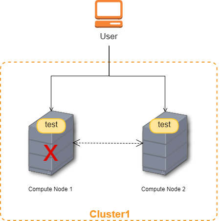

# NCU-HASS User Manual (ver. 4.1)

## Table of Contents

* [GETTING STARTED](#GETTING-STARTED)
  * [DICTIONARY OF TERMS](#DICTIONARY-OF-TERMS)
  * [SYSTEM’S GOAL](#SYSTEM’S-GOAL)
* [HOW TO USE NCU-HASS](#HOW-TO-USE-NCU-HASS)
  * [WEBSITE NAVIGATION FLOW](#WEBSITE-NAVIGATION-FLOW)
  * [SCENARIO](#SCENARIO)
* [HA Admin – HA Clusters Tab](#HA-Admin-–-HA-Clusters-Tab)
* [HA Admin - HA Instances Tab & HA Project – HA Instances Tab](#HA-Admin---HA-Instances-Tab-&-HA-Project-–-HA-Instances-Tab)
* [NCU-HASS feature introduction](#NCU-HASS-feature-introduction)
  * [CREATE CLUSTER](#CREATE-CLUSTER)
  * [DELETE CLUSTER](#DELETE-CLUSTER)
  * [ADD COMPUTING NODE](#ADD-COMPUTING-NODE)
  * [DELETE COMPUTING NODE](#DELETE-COMPUTING-NODE)
  * [ADD INSTANCE PROTECTION](#ADD-INSTANCE-PROTECTION)
  * [REMOVE INSTANCE PROTECTION](#REMOVE-INSTANCE-PROTECTION)

## GETTING STARTED
Welcome to the NCU-HASS User Manual. This manual will help you learn how to use the NCU-HASS as administrator.

:warning:
Note : If you have never used OpenStack before, you can visit https://docs.openstack.org/horizon/latest/user/index.html to get the basic idea of OpenStack.

### DICTIONARY OF TERMS
To make it easier to find the information you need, the following terms are used in this manual:

| No. | Terms          | Definition |
|-----|----------------|------------|
| 1.  | OpenStack      | Open source tools for building and managing cloud computing platforms. |
| 2.  | HA             | High Availability, a system that likely to operate continuously without fault. If primary server fails, it allows the second server to take over quickly. |
| 3.  | Cluster        | A group of connected computers that act as a single system and enable high availability. |
| 4.  | Computing Node | A host in cluster. |
| 5.  | Instance       | A virtual machine (VM) that running in computing node. |

### SYSTEM’S GOAL
NCU-HASS (NCU-High Availability Service System) is a high availability system based on OpenStack platform to enhance the primary purpose of cloud infrastructure and services. When the failures occurred, the system can detect and recover automatically.

The detection function is responsible for detecting various faults, and the recovery function is responsible for recovery after detecting the fault, so that the instance can continue to run and can reduce downtime.

## HOW TO USE NCU-HASS
The NCU-HASS dashboard provides other pages, such as HA Cluster and HA Instance, which can manage cluster and instance protection to support high availability.

### WEBSITE NAVIGATION FLOW

Figure 1. Website Flow

The website flow is shown in Figure 1. The pages provided by NCU-HASS are the pages included in the “HA Project” and “HA Admin” tabs. In this manual, we only focus on the teaching of managing HA clusters, including adding computing nodes and HA instances to the cluster for protection.

:warning:
Note: If you need to understand the whole functions of OpenStack dashboard, visit https://docs.openstack.org/horizon/latest/user/log-in.html

Figure 2. Home Page of OpenStack

After logging into the website, the displayed page will contain the “Project”, “Admin”, “HA project”, “HA Admin” and “identity” tags, as shown in Figure 2. The functional buttons and the description of each button are shown below.

1. Project tab : view and manage the resources in a selected project
2. Admin tab : view usage and manage instances, volumes, images, networks, so on
3. HA Project Tab : view and manage instance
4. HA Admin Tab : view and manage cluster, instance and IPMI
5. Identity Tab : view and manage projects and users

### SCENARIO
The scenario used to describe the usage of the NCU-HASS is shown in Figure 3. First, the user must create a cluster and add at least 2 computing nodes to the cluster. The user then adds the instance to the cluster for protection. Once the protected node or instance fails, NCU-HASS will detect the fault and automatically recover the failed node and instance. In Figure 3, the Compute Node 1 fails, so NCU-HASS evacuates the instance (test) to other normal nodes (Compute Node 2), and attempts to recover Compute Node 1 by restarting the node.

:warning: 
Note : There must be an instance (**test**) and a cluster (**Cluster1**) consisting of at least 2 computing nodes (**Compute Node 1** and **Compute Node 2**).

Figure 3. Scenario

## HA Admin – HA Clusters Tab 
This page is for administrator to manage HA clusters. The HA cluster is an abstract group used to record protected nodes and instances.

Figure 4. HA Clusters Page

1.	HA Clusters Tab		: directing to the HA Clusters page.
2.	Create HA Cluster button	: add new cluster.
3.	Cluster name button	: list of available cluster, directing to computing node page.
4.	Delete HA Cluster button	: delete cluster.

## HA Admin - HA Instances Tab & HA Project – HA Instances Tab
Administrators use the HA Admin – HA Instances Tab, and common users use the HA Project – HA Instances Tab. Both pages are used to add / remove protection to the instance. Instance is the smallest unit to be protected by NCU-HASS.

Figure 5. HA Instance Page

1.	HA Instances Tab			: directing to the HA Instances page.
2.	Add Instance to Protection button: add instance that wants to be protected.
3.	Edit Protection button		: remove instance that wants to be unprotected. 

## NCU-HASS feature introduction
The following is a feature list of NCU-HASS, which will be introduced below:

1.	CREATE CLUSTER
2.	DELETE CLUSTER
3.	ADD COMPUTING NODE
4.	DELETE COMPUTING NODE
5.	ADD INSTANCE PROTECTION
6.	REMOVE INSTANCE PROTECTION

### CREATE CLUSTER
Administrators must create an abstract HA cluster before using NCU-HASS to protect computing nodes and instances.

:warning: 
Note: The cluster can only be created if there is no existing cluster with the same name.

1.	In the **HA Clusters** tab, click the **Create HA Cluster** button.
2.	Enter a new HA cluster name in the editor canvas (Figure 6).

Figure 6. Canvas of “Create HA Cluster”

3. Click **Create** button, and the page will display as follows (Figure 7).

Figure 7. Successfully creating cluster

### DELETE CLUSTER
Administrators can delete HA clusters when needed.

:warning: 
Note: The HA cluster can only be deleted if there are no nodes in the HA cluste.

1.	In the **HA Clusters** tab, select the HA cluster to be deleted by clicking the corresponding **Delete HA Cluster** button. 
2.	Click the **Delete HA Cluster** button to delete the cluster (Figure 8).

Figure 8. Delete cluster confirmation canvas

Figure 9. Successfully delete cluster

### ADD COMPUTING NODE
Administrators can add computing nodes to a specific HA cluster for protection.

:warning: 
Note: The computing node to be added must be running and cannot be added to other HA clusters.

1.	In the **HA Clusters** tab, click on a specific **cluster name** to display the details page of that HA Cluster (Figure 10). 

Figure 10. HA cluster details page

2.	Click the **Add Computing Node** button.
3.	Select the node by pressing the **+** button (Figure 11).

Figure 11. Canvas of “Add Computing Node”

4. Click the **add** button to add the node to the cluster (Figure 12).

Figure 12. Successfully add computing node

### DELETE COMPUTING NODE
Administrators can remove computing nodes from HA cluster to remove protection.

:warning: 
Note: The computing node can only be deleted if there are no protected instances on the node.

1.	In the **HA Clusters** tab, click on a specific **cluster name** to display the details page of that HA Cluster (Figure 13). 

Figure 13. HA cluster details page

2.	Select the node to be deleted by clicking the corresponding **Delete Computing Node** button.

Figure 14. Delete computing node confirmation canvas

3. Click the **Delete Computing Node** button to remove the node from the cluster (Figure 15).

Figure 15. Successfully delete computing node

### ADD INSTANCE PROTECTION
The common user/administrator can add instances to the specific HA cluster for protection. 

:warning: 
Note: The instance to be added must already be running on a node in the specific HA cluster.

1.	In the **HA Instances** tab, click the **Add Instance to Protection** button (Figure 16).

Figure 16. HA Instances page

2.	Select the instance and cluster (Figure 17).

Figure 17. Canvas of “Add Instance to Protection”

3. Click the **Add** button to add the instance to the cluster for protection (Figure 18).

Figure 18. Successfully add instance protection

### REMOVE INSTANCE PROTECTION
The common user/administrator can remove instances from HA cluster to remove protection. 

1.	Select the instance to be removed by clicking the corresponding **Edit Protection** button (Figure 18).
2.	Select ‘Non-Protected’ on Protection field (Figure 19).

Figure 19. Canvas of “Edit Protection”

3.	Click **Save Changes** button to remove the instance from the cluster (Figure 20).

Figure 20. Successfully remove instance protection
