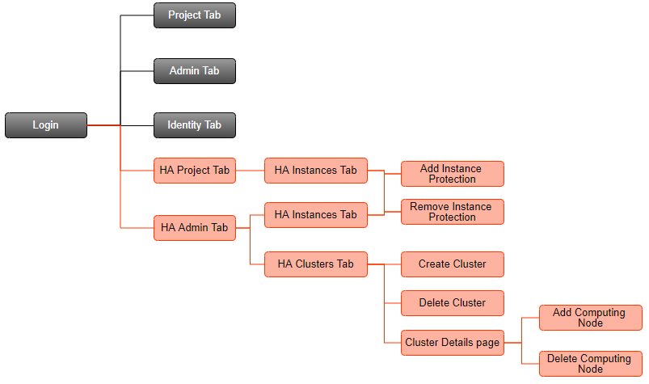

# NCU-HASS User Manual (ver. 4.1)

## Table of Contents

[TOC]

## GETTING STARTED
Welcome to the NCU-HASS User Manual. This manual will help you learn how to use the NCU-HASS as administrator.

:::warning
Note : If you have never used OpenStack before, you can visit https://docs.openstack.org/horizon/latest/user/index.html to get the basic idea of OpenStack.
:::

### DICTIONARY OF TERMS
To make it easier to find the information you need, the following terms are used in this manual:

| No. | Terms          | Definition |
|-----|----------------|------------|
| 1.  | OpenStack      | Open source tools for building and managing cloud computing platforms. |
| 2.  | HA             | High Availability, a system that likely to operate continuously without fault. If primary server fails, it allows the second server to take over quickly. |
| 3.  | Cluster        | A group of connected computers that act as a single system and enable high availability. |
| 4.  | Computing Node | A host in cluster. |
| 5.  | Instance       | A virtual machine (VM) that running in computing node. |

### SYSTEM’S GOAL
NCU-HASS (NCU-High Availability Service System) is a high availability system based on OpenStack platform to enhance the primary purpose of cloud infrastructure and services. When the failures occurred, the system can detect and recover automatically.

The detection function is responsible for detecting various faults, and the recovery function is responsible for recovery after detecting the fault, so that the instance can continue to run and can reduce downtime.

## HOW TO USE NCU-HASS
The NCU-HASS dashboard provides other pages, such as HA Cluster and HA Instance, which can manage cluster and instance protection to support high availability.

### WEBSITE NAVIGATION FLOW

